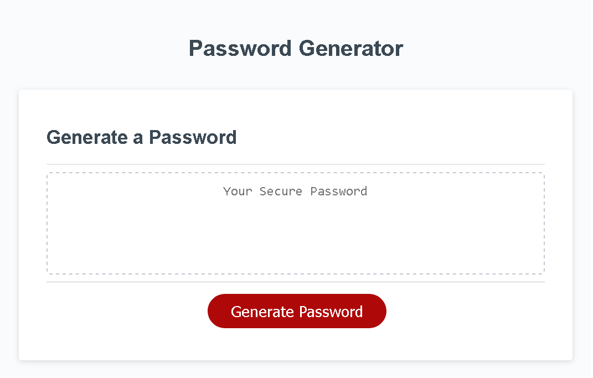

# Password-Generator

## Description
This application generates a random password based on criteria selected by the user. When the user clicks the button, a message will appear asking for the desired password length, which must be between 10-64 characters, a while loop ensures that the user's input is between this length. The next prompts will ask questions about whether the user wants lowercase, uppercase, numbers or special characters in their password, the user must choose at least one option to generate the random password. again a while loop was used to ensure the correct answer. The html, css and javascript logic to generate the button and link the html to the js file has already been provided as initial code.

## Deployment
This is a demo of the deployed application.

When the user opens the console, he might find something like this.

## Things I learnt
Through the development of this project, I learned how to implement functions, how to generate random characters in an array, the usage of while loops and how to reset initial values after an event.

## Technologies Used
* HTML
* CSS
* JavaScript

## Link to deployed application
[Password-Generator](https://vanessadantonio.github.io/Password-Generator/)